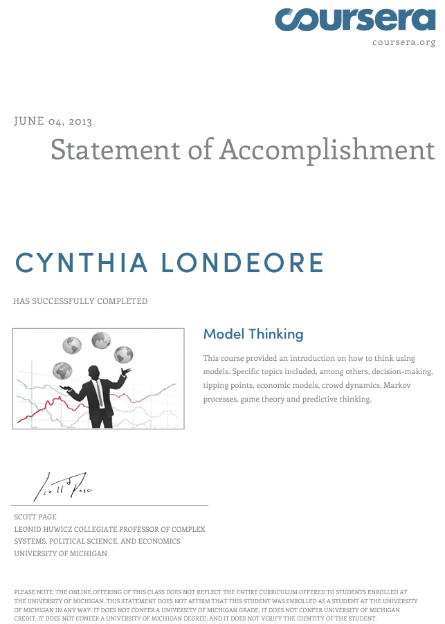

latex input:		mmd-article-header
Title:				Learner Experiences with MOOCs and Open Online Learning
Author:				ed., George Veletsianos
Date:				
Base Header Level:	2
latex mode:			memoir
latex input:		mmd-article-begin-doc
latex footer:		mmd-memoir-footer

<!-- \pagebreak -->
# How do learners experience open online learning? #
**George Veletsianos, PhD**

>At a time when researchers and online learning providers are embracing the use of learning analytics and big data to examine learner behaviors, activities, and actions, very few researchers have sought to gain a deep, qualitative, and multidimensional understanding of learner experiences with open forms of learning.

*Learner Experiences with MOOCs and Open Online Learning* is an e-book in which student authors describe and reflect upon their open online learning experiences. Current conversations around educational innovations in general, and MOOCs in particular, lack student voices. This book enables learners to share their stories, thus contributing to our understanding of open online learning.

A number of questions guided the development of this book. These included: What are learner experiences with open online courses, MOOCs, and other forms of open online learning? What is it like to participate in open online learning? What are learners' perspectives on open education? Answers to these questions clarify the nature of open online learning, help us focus innovations on learners, and aid us in improving digital learning initiatives.

Learner experiences arise from the ways learners interact with and respond to content, activities, instructional methods, instructors, and the context within which learning and instruction happen ([Parrish, 2005](http://bit.ly/14eLBjw)). At a time when researchers and online learning providers are embracing the use of learning analytics and big data to examine learner behaviors, activities, and actions, very few researchers have sought to gain a deep, qualitative, and multidimensional understanding of learner experiences with open forms of learning. Yet, understanding learner experiences is vital. A nuanced appreciation of how users experience open learning, including the successes and obstacles they face, will assist learning designers, researchers, and providers in refining and improving open online learning.

*Learner Experiences with MOOCs and Open Online Learning* delivers two important findings:

-   The realities of open online learning are different from the hopes of open online learning. The disconnect between reality and promise has been observed in a number of other areas pertaining to educational technology (Selwyn, 2010). Learners' experiences with open online learning and MOOCs do not fit neatly within monolithic narratives because these experiences are neither uniform, nor straightforward. For example, learners describe some of their experiences as meaningful and empowering. Others describe them as mundane or simply mediocre. Students encounter formidable obstacles, but also appreciate flexible opportunities for learning. The reality of open online learning is that learners' experiences are neither as overwhelmingly positive as optimists make them out to be, nor as poor as critics suggest they are.

-   We only have small pieces of an incomplete mosaic of students' learning experiences with open online learning. While some research on learner experiences, perceptions, and practices in open online learning exists (e.g., Cheng, Kulkarni, & Klemmer, 2013; Hilton, Graham, Rich, & Wiley, 2010; Koller, Ng, Do, & Chen., 2013; Kop, 2011; Siemens, Irvine, & Code, 2013), [empirical research on MOOCs and open online learning is nascent](http://www.veletsianos.com/2013/06/05/the-research-that-moocs-need/). Furthermore, investigations are conducted in different contexts and focus on different aspects of the learner experience. Thus, we need to recognize that the field's understanding of open online learning is not simply incomplete, but may represent a partial picture of what happens in such settings. The student experiences described in this book contribute to our understanding of online learning, adding missing pieces in an ever-evolving and complex mosaic.

These two insights challenge instructors, administrators, learning designers, developers, and researchers to focus on the *design* of open online learning. The learner experiences shared within this book make it clear that "massive," "open," and "online" do not ensure positive or negative learning experiences. What we need, as a field, is to examine how to (a) design effective, engaging, challenging, participatory, and caring personal learning experiences for emerging contexts, and (b) use pedagogical and technological affordances to foster learning. The experiences described in this book suggest that open online learning providers need to pay closer attention to learners. In doing so, designers will discover that even though individuals appreciate the opportunities provided to them, learners like Valauri (chapter 10) may struggle "more with trying to learn the tools than with trying to learn the [content]," or students like Ota (chapter 3) might attain a certificate but may still experience "feelings of hollowness and incompleteness." Learning designers will also discover that some learners (e.g., chapter 5) may use open online courses in unintended, but meaningful, ways.

It is important to mention that this e-book does not purport to present a generalized description of learner experiences with MOOCs, any specific MOOC, or open online learning. While some MOOCs share certain characteristics (e.g., video-based lectures, discussion boards, peer review for assessment purposes), courses differ in important dimensions, including their design. For example, the [original concept of a MOOC](http://www.elearnspace.org/blog/2012/07/25/moocs-are-really-a-platform/) bears little resemblance to the MOOCs popularized by [Coursera](https://www.coursera.org/), [Udacity](https://www.udacity.com/), and [EdX](https://www.edx.org/). Additionally, while the learner experiences and stories described in this book yield detailed accounts of individual experiences, they do not purport to reveal generalized truths about any particular course or about the experiences of others.

Furthermore, this book should not be taken to represent a description of learner experiences with traditional online education. "Online education" has a long tradition and is a broad umbrella term that captures a multitude of approaches to learning -- from step-by-step tutorials designed to impart specific skills to autonomous exploration of online resources and communities of interest. [Online education and MOOCs are similar, but unique, concepts](http://www.insidehighered.com/blogs/technology-and-learning/bubbles-online-education-and-confused-reporting). Conflating the two does a disservice to the field, to educators who strive to improve learning, and to the scholars who have spent their careers investigating the discipline and practice of online education. Above all however, flattening terms and conflating ideas does a disservice to learners worldwide: such an oversimplification prevents educators, designers, developers, and researchers from seeing what is unique in each context, and impedes stakeholders from improving learning environments and platforms.

### The process behind *Learner Experiences with MOOCs and Open Online Learning* ###

As part of a course focused on online learning, I asked my graduate students to immerse themselves in open online learning endeavors and journal about, reflect upon, and examine their own learning experiences. The purpose of this assignment/experiment was to allow students to explore and investigate open online learning. Students were free to define open online learning in different ways. For example, they could choose from a gamut of open online courses (e.g., from [DS106](http://ds106.us/) to any of the courses offered by MOOC providers such as Udacity, EdX, and Coursera), or they could identify skills, competencies, and content they wanted to learn and carve their own path towards desired outcomes. I asked students to focus on topics that were of interest to them and to participate in this experience for two months. To accommodate for variations in course start dates, course lengths, and unexpected events (e.g., course cancellations), I allowed students to explore and participate in more than one experience if the need arose. I felt that such a flexible approach was reasonable (and perhaps necessary) to approximate what individuals do when they undertake open learning out of their own volition.

Put simply, I asked my students to pursue lifelong learning endeavors in relation to topics that were of interest to them and write short essays describing their experiences.

Even though this activity was originally developed as a way for students to "do" open online learning, and not just "read about" it, as my students examined open online learning in more detail, I became motivated to share their experiences and stories with others. In particular, during this time I came to the following three realizations that encouraged the sharing of their experiences:

-   *The narrative of MOOC successes is often one-sided*. MOOC providers tend to share the stories of extraordinary individuals that overcome insurmountable struggles to succeed in MOOCs (e.g., individuals in conflict-ridden [Afghanistan](http://singularityhub.com/2012/01/28/sebastian-thrun-aims-to-revolutionize-university-education-with-udacity/) and [Syria](http://blog.coursera.org/post/54893006665/it-is-never-too-late-to-start-again-a-syrian) that participate in MOOCs). These stories are inspiring. These individuals can serve as role models for others and should be celebrated. At the same time however, there are numerous individuals that have struggled with and abandoned MOOCs, individuals whose life circumstances, motivations, and needs negatively impacted their learning. The stories of these individuals are rarely shared. They are, in fact, concealed. They become figures and statistics (e.g., "90% dropped out" or "82% completed the first two assignments"), and their stories remain untold.

-   *Discussions surrounding MOOCs and open courses lack a deep examination of the human experience*. [MOOCs are still experimental](http://mooc.efquel.org/week-7-moocs-quality-by-martin-weller/), but at a time when enthusiasts hope to personalize learning experiences and make them [more engaging](http://www.usnews.com/education/online-education/articles/2013/06/21/moocs-expand-on-college-campuses), we have little evidence of what it is like to learn and participate in a MOOC. Even though a number of MOOC [review](http://coursetalk.org/) [sites](http://www.knollop.com/) exist, and some participants -- such as [Karen Gallagher](http://www.insidehighered.com/views/2013/06/11/essay-disappointing-experience-mooc), [Jonathan Rees](https://moreorlessbunk.wordpress.com/2012/12/21/world-history-mooc-report-16-in-which-i-try-to-sum-the-whole-thing-up/), and [Mary Stewart](http://wheel.ucdavis.edu/2013/02/moocs-as-participatory-communities-my-experience-with-elearning-and-digital-cultures/) -- have provided testimony, personal accounts are hard to find.

-   *Discussions surrounding MOOCs and Open Courses rarely include student voices*. The discussions and debates in the field focus on a number of issues pertinent to students (e.g., affordability, access, learning outcomes), but forums for students to express their opinions about these issues are limited. In fact, valuing, respecting, and appreciating the student voice is one of major accomplishments of the progressive education movement, but it seems that this voice has been drowned in the frenzy and excitement surrounding the massive open online course phenomenon.

These three realizations led me to seek ways to enable my students to tell their stories to a broader audience. Their experiences – positive, negative, ordinary, extraordinary – paint an intricate picture of open online learning that needs to be shared.

I discussed these issues with my students, and together we decided to seek ways to share their essays with others. We debated self-publishing essays (as others [have](http://pm4id.org/) [done](https://en.wikibooks.org/wiki/Breaking_the_Mold:_An_Educational_Perspective_on_Diffusion_of_Innovation)), publishing the essays with an academic book publisher, or sharing them via our social media channels. We decided that we wanted the essays to be peer-reviewed, published as part of a collection, and to become available quickly so as to contribute to the conversation at a time when the field needs it most. The editors of *Hybrid Pedagogy* shared our vision and were eager and excited to provide a forum for the learner voice to be heard. The outcome of this endeavor is the e-book that you are reading: a collection of essays, a collection of learner stories of their experiences with open online learning.

### Concluding thoughts ###

As designers, researchers, and educators aiming to create learning experiences that are effective, worthwhile and sensitive to student needs, it is imperative that we involve learners in conversations and decisions surrounding education. I hope that this e-book provides a valuable resource for students, researchers, and designers to understand learner experiences with open forms of learning, and that it encourages others to study learner experiences and to contribute to our shared understanding of what it means to teach and learn in today's emerging learning environments.

### References ###

Cheng, J., Kulkarni, C., & Klemmer, S. (2013). Tools for predicting drop-off in large online classes. Proceedings of the 2013 conference on *Computer Supported Cooperative Work*.

Hilton, J. L., Graham, C., Rich, P., & Wiley, D. (2010). Using online technologies to extend a classroom to learners at a distance. *Distance Education*, 31(1), 77–92.

Koller, D., Ng, A., Do, C., & Chen, Z. (2013). Retention and Intention in Massive Open Online Courses: In Depth. *Educause Review Online.* Retrieved from[http://bit.ly/10MwVK6](http://bit.ly/10MwVK6)

Kop, R. (2011). The challenges to connectivist learning on open online networks: Learning experiences during a massive open online course. *The International Review Of Research In Open And Distance Learning*, 12(3), 19-38.

Parrish, P. (2005). Embracing the aesthetics of instructional design. *Educational Technology*, 45(2), 16-25. Retrieved from [http://bit.ly/14eLBjw](http://bit.ly/14eLBjw) 

Selwyn, N. (2010). Looking beyond learning: notes towards the critical study of educational technology. *Journal of Computer Assisted Learning*, 26(1), 65–73.

Siemens, G., Irvine, V., & Code, J. (2013). An Academic Perspective on an Emerging Technological and Social Trend. *Journal of Online Learning and Teaching*. Retrieved from [http://jolt.merlot.org/vol9no2/siemens\_editorial\_0613.htm](http://jolt.merlot.org/vol9no2/siemens_editorial_0613.htm) 

<!-- \pagebreak -->
# Searching for Extraterrestrials, One Video Lecture at a Time #  
**Jennifer Ramirez**

>It was empowering and refreshing to take a course that had absolutely nothing to do with my career or course load. Due to a lack of prerequisites, I would never be able to walk into a university and sign up for this type of course.

I am not a science fiction fan. Nor am I a biologist, chemist, or an astronomer. I selected the [Astrobiology and the Search for Extraterrestrial Life](https://www.coursera.org/course/astrobio) course on a whim. I had read[ an article on habitable moons](http://www.google.com/url?q=http%3A%2F%2Fwww.sciencenews.org%2Fview%2Fgeneric%2Fid%2F347651%2Fdescription%2FLife_has_prospects_on_moons_of_giant_extrasolar_planets&sa=D&sntz=1&usg=AFQjCNF4Fngxe1uav2isUcgW2QEf_orKUA)the day before I selected this course, which sparked my interest on the topic. I wanted to start a course immediately, so I reasoned that I'd look in on the Astrobiology course for a week, and then possibly move on to a more practical course. The Astrobiology course caught my eye because it seemed so different from the personal finance and computer science courses that I had seen on[ Coursera](https://www.coursera.org/) and other online learning platforms.  This is exactly the type of course that I would not sign up for in a traditional face-to-face setting. My content knowledge in the topic is weak and I have not taken many of the prerequisite courses in years. My interest in the course is also purely personal and is unrelated to anything in my area of study. If I were not able to learn about the topics in Astrobiology through a planned, sequential course, I am not sure that I would have the ability or direction to engage in a personal study of these topics. Taking this course was incredibly empowering because it was so completely outside the range of courses of what I felt I should be taking. It was not related to my degree or to my current profession at all. I did not need the completion certificate for the Astrobiology course, nor could I potentially leverage it in any work-related setting, but I still wanted to take this course. To me, this opportunity was truly an experiment in learning for the sake of learning.

### Content ###

The content of this course dealt with the ways that life, as we know it, came to be and how it evolved. The goal of the course was to examine how life may be distributed and to examine the question, "Are we alone in this universe?" The course began with the conditions needed for life to exist on earth and provided a solid and necessary understanding for what we should look for when we search for habitable planets, along with the possibility of life on those planets. The course started with basic content in biology, chemistry, geology, ecology, and astronomy. I've never taken ecology or astronomy, and it's been more than 10 years since I have taken a course in biology or chemistry. As a result, I was apprehensive about studying even the very basic concepts of these subjects.

For the first few weeks, I was extremely uncomfortable with the content. I was frustrated that I did not know facts such as the name of the chemical building blocks of proteins. Even toward the end of this experience, I still felt some of the same frustration when I couldn't remember exactly how something like the Doppler effect is used to search for extrasolar planets. At times, the overall feeling of the course was that of watching an interesting television documentary, and then being quizzed upon the details.

Stepping back from my experience, I realize that I did not understand all of the content, but I was still learning a lot of interesting information. I appreciated the fact that the professor emphasized that this is a growing field and much is still yet to be discovered. This fact was reinforced by the current articles that I was finding daily through my own searches and links posted by my classmates.

### Structure and Delivery ###

The course was offered through the University of Edinburgh and it was taught by by Dr. Charles Cockell. Dr. Cockell worked with a team of two people: a postdoctoral researcher named Jesse Harrison and a graduate student named Casey Bryce. Dr. Cockell was the only person who gave the video lectures, but all three participated in the discussion forums.

The content was divided in modules, with two modules per week. Each module had anywhere from 2-6 video lectures and a quiz. The quizzes allowed 3 attempts, with 20% penalty for using the 3rd attempt. I was somewhat disappointed that all of the content was delivered via video lecture. I would have liked more assigned reading material similar to the article that I found the day before I signed up for this class.

Even though I felt I was struggling, I had strong scores of 75% to 85% correct on the quizzes. The quiz questions consisted of broad, big idea type concepts along with some very specific questions. There were some questions that covered content that I later realized was only mentioned briefly, or said in a way that may have required a stronger background knowledge to interpret and apply. There was such a large amount of information given in each lecture that I struggled to decipher the important information and predict which concepts would be on the quiz.

A few weeks into the course I discovered that transcripts of the lectures were available to download, so I began to download those and read along as I watched the videos. To improve the lectures, I would recommend adding the transcript or subtitles as a permanent feature of each lecture so that learners can read along more easily.

This course can best be described as being guided by a behaviorist learning approach. The primary controller of the content was the instructor. This lead to teaching being defined as giving structured and sequenced information to the student. Correct performance in this type of model is rewarded and incorrect performance is penalized.

Though the design of the course seemed to fall under a traditional, behaviorist perspective, the use of the discussion boards had the potential to create a constructivist and connectivist learning environment in which students functioned as sources of knowledge. Many of the students in the class contributed knowledge by posting links to articles and videos relating to the topic, but I felt like this aspect of the class could be built upon and encouraged more. This is especially true for a field such as Astrobiology that is making new discoveries daily.

### Collaboration ###

The discussion forum was the primary form of collaboration for this Astrobiology course. There were discussion boards within the forum that were organized into sections for lecture comments, technical feedback, general discussion, and interests. Because of the large number of students taking the course, I found it difficult to navigate the discussion boards. There were so many posts that I was overwhelmed. It was also frustrating that some of the posts did not pertain to the topic of the board. For example, on a board that was dedicated to lecture comments, there was a discussion about what types of spaceship an extraterrestrial would use, when no mention of space travel was made in the lecture. There were also some instances of negative posts where fellow learners were extremely rude or sarcastic, but it did seem that the learning community as a whole regulated this behavior. The discussion board software allowed students to vote up or vote down posts, and many of the negative posts were voted down so many times they appeared at the very end of the discussion board.

One improvement that I would strongly suggest would be to have discussion boards located in closer proximity to the video lectures and the quizzes. If I had a question pertaining to a quiz, I had to navigate completely out of the quiz area to the discussion forum. From there, I would have to navigate within the forum to the discussion thread about the quiz. Having discussion capability directly on quiz and lecture pages would make posting less cumbersome and would encourage posters to remain more on topic. I would also be less likely to make off-topic posts on a board that was directly linked to a video or lecture.

I would also recommend that the instructors encourage or possibly even assign collaboration as part of the requirements for the course. There is a multitude of information that can be found online and shared on the discussion forums, but if this is not encouraged, students will miss out on this important learning opportunity.

### Conclusion ###

Overall, the course was a valuable learning experience and did not present too many challenges. It was empowering and refreshing to take a course that had absolutely nothing to do with my career or course load. Due to a lack of prerequisites, I would never be able to walk into a university and sign up for this type of course. I also lack the focus or know-how to pursue a personal study of this topic. Though this course may not have any direct application or use in my professional life, I am now able participate in a conversation on extraterrestrial life.

<!-- \pagebreak -->
# MOOCs: Falling Short of What Online Learning Could Be #  
**Michael Ota**

>I began the course wanting to acquire a comprehensive review of statistics, but by the time the course ended I was left with a partial sense of accomplishment and feelings of hollowness and incompleteness.

Online learning promises significant advantages over the traditional face-to-face setting: self pacing; access to infinitely vast resources on the Internet; engaging and immediately responsive instruction; and a diverse and effective community of co-learners available 24-7 for feedback and connection. I believe the power of online education is in changing how we learn. While taking wo Statistics MOOCs (one through EdX and one through Udacity) however, I felt that the courses fell short of their platform's potential.

### My first statistics MOOC ###

I started with a [Statistics](https://www.edx.org/course/uc-berkeley/stat2-1x/introduction-statistics/594)[course through EdX](https://www.edx.org/course/uc-berkeley/stat2-1x/introduction-statistics/594). I chose this because I was beginning the data analysis phase of my MA thesis and thought it would be good to refresh my knowledge on the topic.

The course followed a rigid structure, with a weekly release of content. Each unit had 3 or 4 lessons that contained a series of video lectures, practice problems, and graded practice sets. The platform graded answers automatically, but did not provide feedback until the midterm.

I had a frustrating and stressful experience with this course, even before it started. The course faced logistical problems from the beginning. First, the start date was delayed by 10 days. The explanation provided was that the teaching team wanted to improve the curriculum so the course could be better executed. It seemed that the course was undergoing restructuring right up to the time it began. Second, originally the course description stated that this course would last one month, and would be followed by two other one-month courses that together would cover one semester's worth of material, for a total of 15 weeks. When the course finally started, this changed and part one would last for two months and subsequent courses would be created to cover the remaining parts. These logistical issues were unexpected. They added time constraints and made me feel overwhelmed.

In addition, the flow and structure of the class seemed awkward to me. I have a math degree and background, including experience in curriculum development, teacher training, and teaching math at the secondary and college levels. As a result, I often think about the presentation of math concepts and how an audience receives that presentation. The lessons were essentially PowerPoint presentations with voice-over. The delivery was simply boring. The videos were 10 to 15 minutes long for each segment of the lecture, and the practice problems involved superficial situations that seemed disconnected from anything authentic. Many of the problems involved the use of data that had no real connection to how statistics is used in the real world. For example, interquartile range (an exceptionally abstract concept) was presented and practiced in abstract data, with no indication of how this type of calculation might be used outside of the classroom.

The teaching staff seemed defensive in their interactions with students, both in my own experience and what I observed on the discussion forums.To illustrate: At one point, one question asked students to find the median of a data set, and even though I selected the correct answer, I was marked incorrect. I knew that my selected answer was correct and confirmed it to be so through checking other sources. I turned to the discussion forum located conveniently at the bottom on the exercise set and after searching the forum postings on a solution to this issue, I did not find any postings that were useful in resolving the issue I was facing. Therefore, I posted a comment stating that the grading was incorrect. My experience in the class thus far led me to expect replies that were going to be candid, but respectful. Over the next few days, I received several (mostly) supportive comments from other students, with useful information directing me to the source of how the problem was done. The response I received from one of the teaching staff, however, was neither supportive, nor helpful. Instead it was scolding, stating that it was obvious I hadn't viewed the lecture. While I didn't expect staff to instantly take my word that there was a mistake, I certainly didn't expect negative and condescending remarks.

I also experienced a great deal of stress due to the graded practice sets and a progress-based grade book. I found myself falling into old habits of constantly checking that progress. I soon felt defeated once my overall grade was locked in below 70%. I revised my expectations downwards from achieving an A to scoring enough points to pass (35%). I ended up receiving a 55% mastery and was awarded a certificate of successful completion. I began the course wanting to acquire a comprehensive review of statistics, but by the time the course ended I was left with a partial sense of accomplishment and feelings of hollowness and incompleteness.

### My second statistics MOOC ###

Due to that fact that the EdX course ended earlier than anticipated (8 weeks instead of 15) and I felt unsatisfied by my review of statistics, I enrolled in a [second statistics](https://www.udacity.com/course/st101)[course](https://www.udacity.com/course/st101). This course was provided through Udacity and had no start/end dates or timeline. It simply consisted of a sequence of video lectures. The Udacity course was less stressful because the lack of deadlines allowed me to work at my own pace. In addition, the content of this course was engaging, as the videos embedded practice problems relevant to real life and provided feedback. For example, the very first problem was set in the context of the personality types of Facebook friends that might be on my friend list. I distinctly remember feeling engaged and interested in the idea of how a simple concept of probability could be lurking in my daily online interactions.

My experience with the Udacity course was positive, and thus completely different from the first course. Even the opening video describing the course was engaging and interesting. The presentation platform was also impressive as it allowed me to enter answers directly on the video, provided immediate feedback, and gave me the option to watch video explanations.

The Udacity course was an open-ended learning experience as there was no timeline or gradual release of content. I could jump back and forth between topics, practice sets, and units. There was a linear layout that I could follow if I wanted to, but my transition through the content was flexible. In addition, there were no grades involved in the Udacity course, and my focus was on what I needed to know to complete the practice sets. I was more driven in the few weeks with this course than in the 2 months in the EdX course.

However, even though I had the freedom to move between topics, I was limited by the topics pre-selected by the course designers. I would have rather been given a problem set and a list of topics to research for further flexibility. Just as in the EdX course, the Udacity course required me to solve problems using a specific method, even though there are different methods that I could have used to arrive at the correct answer. For example, Bayes' rule was outlined in a step-by-step fashion, with emphasis placed on correct execution of each step. I found this approach confusing, especially as there are other methods that I could have used to solve the problems.

### Suggestions for improving the learning experience ###

To offer a better learning experience, the two courses that I participated in should revise the ways in which they deliver content in the following three ways:

-   The greatest departure from good instructional design practice was in the question sets and assessments. Often, the problems were loosely related to the lesson and guided practice materials. The loose connections often led to confusion and diminished my experience.
-   Another issue that I faced was in the use of video (i.e., "talking head") and text-based materials, which were not engaging. Current technologies could provide a platform for a connected and interactive experience that interlaces media with Web 2.0 tools (e.g., [Google Hangouts](https://www.google.com/+/learnmore/hangouts/)). This also allows for more peer-to-peer interaction that would support student-centered learning.
-   Finally, the learning experience lacked flexibility. The courses can become customizable by allowing students to choose to solve problems and apply the material in different ways. Even though the Udacity course material was presented in authentic ways (e.g., the types of personalities of Facebook friends), it was still prescribed and limited.

If the platforms were more open, allowing flexibility, interactivity, and connections to others, my experiences with both courses would have been greatly improved.

### Thoughts on Learning Theory ###

Both the EdX and Udacity courses appeared to be based on traditional [behaviorist and cognitivist learning theories](http://vccslitonline.cc.va.us/usingweb/bckgrnd.htm). The courses were formatted with a lesson cycle of information acquisition, practice, feedback, and assessment. In my opinion, the designers were expecting students to come in with a "clean slate" with respect to prerequisite knowledge (i.e., all you needed was knowledge of basic arithmetic) and to answer the practice questions based on only the knowledge acquired from the lectures. Essentially, their approach to learning was based on the traditional classroom model of education, with the delivery simply transferred to the online platform.

However, even though designed in a structured way, my actual experience with the course was much more fluid. By reading the discussion forums, it was evident that many of the students, including myself, had prior knowledge and were trying to apply that knowledge to the course. I have a large amount of statistics education and training, so when I encountered an error in one of the problems from the EdX course, I used my prior knowledge to develop an acceptable answer. I pulled together a number of sources and used them in my response, which I then shared with the other students in the course. In both courses I chose to research and piece together my understanding of the topic while I was attempting the practice sets instead of just watching the professor's lectures or cycling through the units in a linear sequence. In this way, I believe that my approach departed from what the designers intended since both courses emphasized watching the videos and completing the work through the learning management system.

To summarize, I felt that my experience with both of these courses fell short of what online learning could accomplish. Both courses used the technology as a tool for presenting content and assessing my mastery of that content, but each approached it in an entirely different way. The EdX course felt like a traditional math class, yet had a more active online community that seemed to support my learning process. The Udacity course felt open and engaging, but taught strictly prescribed steps to solutions that stifled my creativity. However, knowing the capabilities of the technology and the unique elements of these courses, this experience has solidified my belief in how MOOC platforms could be on the cusp of a great impact on learning.

<!-- \pagebreak -->
# Culinary Creations from the Online Chef #  
**Mary Bisheh**

>The support and encouragement made me want to further my participation in the community and comment on other's posts. I felt a sense of social duty to be a contributing member of the group and maintain my group identity...

My online participatory experience happened within the world of [Epicurious.com](http://www.epicurious.com/), playfully billed as the site for "people who love to eat." The website itself includes an informational food and recipe database, message forums, interviews with celebrity chefs, and abundant tips and ideas on cooking. Even though the website appeared to be overwhelming and full of activity, it still seemed manageable. I entered this world and took advantage of it by letting my own interests and passions on the topic drive my decisions on how to fully utilize the site. For a few weeks I immersed myself into the world of cooking and recipes, and was a willing and eager participant into this easily overlooked, yet fascinating world.

There were a number of aspects of this experience that appealed to me. For example, I could examine the recipes that interested me and explore the materials at my own pace. My homework, rather than being papers or problems, would be cooking recipes, meals, desserts, and documenting my culinary creations. Since cooking is a relaxing activity and something that I strive to improve at, I was motivated to engage with this project.

At the same time however, I did have many concerns about the experience. My perception of online learning through a more unstructured experience was that the participants need to be very self-motivated to find what they are looking for. Additionally, participants also need to be able to sift through and make sense of large amounts of information. I was unsure if the site would have enough information to sustain my interests and if I would be diligent enough to participate on regular basis to make the experience worthwhile.

Another concern was the commercial nature of the website. The site, while having many good attributes, also included advertisements and paid recipes or cookbooks that users could add to their own collections. I disliked the commercial nature to some extent; at the same time, commercialization seems to be an inevitable consequence of participating in special interest sites. This situation made me think about issues regarding the commercialization of education, specifically with the growth of online learning. I fear that corporations like Apple or Google who develop the technologies and software necessary to facilitate online learning might not always have the interest of education in their sights. Is the commercialization of education the inevitable price to pay for online learning? I'm not sure, but I did feel as though these concerns did not overshadow my own learning experience.

Epicurious has vast quantities of recipes -- these come from cookbooks, celebrity chefs, and other members. The collection of recipes is an example of "wikification of knowledge" discussed by [Mazoue (2012)](http://link.springer.com/article/10.1007/s12528-012-9054-2). Wikification of knowledge in this context refers to an ongoing collection of knowledge from various sources which can further be updated and revised. The traditional example used to illustrate this idea is [Wikipedia](http://en.wikipedia.org/wiki/Main_Page), a collaboratively-edited encyclopedia. The vast amount of free information available on the Internet raises the question: Is it necessary to buy books (or cookbooks in my case) anymore? I enjoyed the ease with which I was able to search the site and appreciated having access to ratings provided by others to alert me to the quality of recipes. All these features are not possible in print media, and having access to them supported my learning.

Most recipes on Epicurious are posted in text form, without any images or visuals attached to them. Some contained [pictures or tips](http://www.google.com/url?q=http%3A%2F%2Fcommunity.epicurious.com%2Fpost%2Fgrilled-summer-vegetables-tuscan-marinade&sa=D&sntz=1&usg=AFQjCNFNe8wZlTWYSI752VctwxBTjVK1dg), and a few even [included video](http://www.epicurious.com/video/80-global-dishes/80-dishes-iran-polow-persian-rice/19855819001). I tried creating meals using all these different recipe types. The recipes that were in text [(pumpkin bread](http://www.epicurious.com/recipes/food/views/Pumpkin-Bread-367512), [turkey meatballs](http://www.epicurious.com/recipes/food/views/Spaghetti-with-Turkey-Meatballs-394791), and [tabboule](http://www.epicurious.com/recipes/food/views/Lebanese-Tabbouleh-106589)[h](http://www.epicurious.com/recipes/food/views/Lebanese-Tabbouleh-106589)) came out ok, even though I was unsure of how much spice I should use and lacked a visual representation of how the finished product would look. Additional resources in text-based recipes, such as images, would have been helpful. The recipes I tried that included pictures or tips ([roasted chicken](http://community.epicurious.com/post/winner-winner-chicken-dinner-1332120962), [fresh herb kuku](http://www.epicurious.com/recipes/food/views/Fresh-Herb-Kuku-231921)) were great and the result was very tasty. Finally, the video recipe ([saffron dill rice](http://www.epicurious.com/video/80-global-dishes/80-dishes-iran-polow-persian-rice/19855819001)) was also was a success. The recipes that contained visuals were immensely beneficial in relaying to me what the final product should look like. I recognize that my I appreciate visuals, hence why I succeeded with the recipes that contained more images and video.

Toward the end of my experience, I decided to participate more in several of the recipe swap communities. I took time to create several posts, and to comment on other people's posts. My posts inquired about recipe ideas for Persian New Year. The responses I received were detailed, precise, and encouraging. The online moderator of the group even asked if I would post again to update everyone on my progress. Because my input was specifically asked for, I felt compelled to take the time to update my fellow group mates and provide them with detailed explanations of how my cooking adventures were going. The responses were resoundingly positive. Most group members complimented me and remarked on the apparent deliciousness of my food. I was surprised at how their reactions affected me. The support and encouragement made me want to further my participation in the community and comment on other's posts. I felt a sense of social duty to be a contributing member of the group and maintain my group identity (green\_girl) by commenting on other people's posts as they had taken the time to comment on mine. There were no negative responses, and everyone was contributing because it seemed that they had something to say and they wanted people to know it was them who responded.

In participating in an open online learning experience, I feel like I've become a more skilled cook and have discovered some great recipes in the process. Despite the fact that I was initially worried about the unstructured nature of this learning experience, I ended up discovering that the ease with which I was able to work created a genuine learning experience that maintained my interest. I could however understand how less focused online learning students might struggle with the same sort of unstructured "take it at your own pace" attitude. [Anderson, Poelhubber, and McKelrich (2010)](http://www.westga.edu/~distance/ojdla/Fall133/anderson_poellhuber_mcKerlich133.html) for example note that there are "higher attrition rates associated with self-paced learning." On the contrary, having the ability to select and contribute to the recipes I was most interested in, and making connections with people in the online discussion groups kept me motivated. The ownership of the project via personal choices was empowering and gave me insight as to how [participatory cultures](https://mitpress.mit.edu/books/confronting-challenges-participatory-culture) can be self-sustaining entities. This experience highlighted for me how I personally learn best and what kinds of online experiences are more meaningful to me. While the collection of recipes, information, and knowledge was exciting to explore, the online forum and group discussions were especially impactful. I hope to maintain my own Epicurious recipe box and maintain my online presence from time to time in the recipe swap forum.

<!-- \pagebreak -->
# MOOCs made me see the potential of online learning #  
**Hui-chieh Chen**

>A unique aspect of my MOOC experience is the fact that I enrolled in and started this course during its fourth week. At the end of the course, I went back to the modules I missed and completed those on my own.

I took the course "[Fundamentals of Human Nutrition](https://www.coursera.org/course/humannutrition)" offered through Coursera and the University of Florida. Dr. von Castel-Roberts was the course instructor and had seven years of online teaching experience. The course seemed to welcome all levels of learners and was an introduction to human digestion and absorption of nutrients, nutrient properties, deficiencies, toxicities, and dietary guidelines. Readings were assigned from the [Kansas State University Human Nutrition Flexbook](https://drive.google.com/folderview?id=0ByOHn1XKLsxbNWM2MGE3M2UtOTc4MC00N2RlLTgxY2UtYjY1NzExYTU3Y2I3&usp=drive_web&pli=1&hl=en#), which is an open textbook whose development is described [here](http://www.educause.edu/ero/article/kansas-state-university-human-nutrition-hn-400-flexbook).

The course was organized in ten modules that each lasted for one week. The course was well structured with weekly tasks, assignments, and grading rubrics. Assignments included making a five-day diet plan, building a [concept map](http://cmap.ihmc.us/docs/conceptmap.html) for the whole course, and editing the textbook used for the class. The delivery of the content was through links to the e-textbook and lecture videos of PowerPoint slides. The textbook was easy to read, but some chapters were dry. The instructor suggested learners read the assigned materials first, then watch the 30-minute video lecture, and finally take the quiz and participate in the discussion forums. Her lectures summarized the important concepts from the textbook. This process is similar to most of my traditional face-to-face graduate courses: reading assignments before class, explanation and discussion during class.

Students could choose between three levels of course engagement: understanding, application, and synthesis. Students who chose the application or synthesis level and did all the required assignments were eligible to obtain a certificate of completion. Providing participation options made the course flexible, because this design decision allowed me to decide the amount of involvement that I wanted to have based on my time and ability. I did not aim at obtaining a certificate, and I was satisfied with seeking to understand the material. This level of commitment only required me to participate in the weekly discussion forums and take quizzes. I felt empowered to decide my own learning depth considering my desired workload and rewards. In [Learning, Freedom, and the Web](http://learningfreedomandtheweb.org/), Kamenetz described how rewards in the form of badges could contribute to personalized achievements and thus provide extrinsic motivation to online participants. I experienced this phenomenon as my choice guided my learning and motivated me to complete all the required tasks to prove that I had reached that level of knowledge.

One interesting feature of this course was peer assessment. Each learner submitted his or her own project report and evaluated others' according to a grading rubric. With such help from students, the instructor wasn't the only person responsible for grading and the learners could benefit from looking at peers' work. In addition, peer assessment provided an efficient solution for evaluating class projects in an extremely large class.

At first, I was disappointed to see that the instructor did not respond to individual student posts. She would only respond to issues relating to peer assignments, course content, and learning materials, and would make course announcements aimed at all learners. Instructor-student interactions were very limited due to the fact that there are so many learners in the course. This experience was different from my classroom learning experiences where the instructor usually gives frequent feedback to the students. The instructor's low level of online presence made me doubtful on whether my discussion board posts could be seen. However, I soon realized that it was more feasible to receive help from more experienced or competent peers.

The discussion forums were a source of learning and frustration. On the one hand, I benefited from the discussion forums because they made me feel like sitting in a classroom participating in discussions with a diverse group of peers. These peers would contribute their own personal experiences, expertise, hyperlinks, empirical studies, and have discussion and debates. The weekly discussion topics were interesting and engaging to me, and I was eager to participate and had to always push myself to absorb the reading content quickly in order to pose questions/comments or respond to other classmates in the discussion forums. However, I was also frustrated that many learners created new discussion threads rather than responding to existing ones. One suggestion to address this problem would be for the course design team to post participation guidelines to facilitate massive group discussions. For example, authors could provide brief descriptions of the topic on a subject line when creating a new discussion thread.

One of the engaging aspects of this course was that it was designed with some consideration of the learners' diverse cultural backgrounds. Even though most of the course content was based on North American eating habits and health problems, the assignments helped balance the course by posing more open-ended issues to invite multi-cultural discussions and projects. For example, one of the multi-cultural activities assigned was to create a five-day diet plan for a trip. The instructor encouraged learners to collaborate with partners from different countries and investigate local meal cultures. I felt this project was relevant to my multi-cultural experience with foods: I am from Taiwan and have lived in North America for two years. While doing the project, I used my life experiences to create a healthy diet plan of Asian and American flavors for one of my trips to Chicago. In addition, I was excited to share information about Taiwanese food with other classmates. I felt greatly enriched by this project and I was glad to participate even though this project was not required for the understanding track that I was aiming towards.

A unique aspect of my MOOC experience is the fact that I enrolled in and started this course during its fourth week. At the end of the course, I went back to the modules I missed and completed those on my own. Thus, for seven weeks my participation was synchronous and on-pace with the rest of the students taking the course. During those weeks, I participated in the course according to the schedule provided. When the course ended, I went back to explore the three first weeks of the content. At first, I enjoyed the lack of pressure, as I was able to engage with the content in my own time. But then, I found that the absence of social interactions with other learners made me feel less motivated to think deeply about the content.

Based on my two different learning experiences with this MOOC, I would suggest that learners interested in projects and peer collaboration should follow the course schedule. Those learners who merely expect some understanding of the course materials, a more flexible self-paced style approach would suffice.

Overall, I had a positive experience with my first MOOC. I appreciated the structured learning experience and the opportunity for varying participation in the class (allowing for flexible learning). Alternative perspectives made the discussion topics more holistic and the peer assessments made the projects feasible in the massive course settings. Apart from a few issues outlined above, the instructor and the course design team lent support for learners' problems. With some fine tuning and implementation, I believe this course can be improved for the benefit of a greater number of learners.

<!-- \pagebreak -->
# Free, but monotonous and frustrating? #  
**Afriannoor Miradinata**

>MOOCs have the potential to offer free education. Yet, in my course I encountered frustrations, dissatisfaction, and monotony.

Even though I participated in a small online course offered through my university in the past, this was my first experience with a MOOC of any kind. I found many courses at [edX](http://www.google.com/url?q=http%3A%2F%2Fwww.edx.org%2F&sa=D&sntz=1&usg=AFQjCNEwo4Is624erSNdxlp4bpowHw5SrA), including one that I was especially interested to join at the time: [The Challenges of Global Poverty](https://www.edx.org/course/mit/14-73x/challenges-global-poverty/585). I read the overview about the course to ensure that I was making the right choice before registering, paying special attention to the prerequisites, estimated effort, frequently asked questions, and staff background. I found the course compelling because it covered issues surrounding global poverty and invited me to think deeply about the real challenges of poverty today.

The instructors teaching the course were Abhijit Banerjee and Esther Duflo, both professors of Economics at MIT. The topics covered in the class were global issues (e.g., food, health, family, and education) that were also covered in the instructor-authored book: [Poor Economics: A Radical Rethinking of the Way to Fight Global Poverty](http://www.amazon.com/Poor-Economics-Radical-Rethinking-Poverty/dp/1610390938/ref=sr_1_1?ie=UTF8&qid=1372971672&sr=8-1&keywords=Poor+Economics%3A+A+Radical+Rethinking+of+the+Way+to+Fight+Global+Poverty). A digital copy of the book was made available to the class for free in PDF format, though protected in such a way that it was posted as an image file and students could neither download the whole book, nor copy and paste text from it. It's ironic that a course focusing on poverty included such an economic constraint. A link to download the whole book for offline reading or printing would have supported my learning. However, the instructors provided additional readings such as online articles, lecture slides, data, and diagrams that supported my understanding of the topic.

The course website was well organized. The platform included a permanent menu at the top of the screen with links to discussion boards, course information, and schedule, allowing me to easily access the hottest topics from weekly discussions and see instructor responses. The modules for each week were listed on the left hand side of the screen so if I wanted to go back to the previous week's topics it was easy to do so. In addition, the video lectures included different options such as video speed, subtitles, and captions - these helped me a lot. For example, I increased the speed of the video to 1.5 if I felt I already understood the main idea, or wanted to find a specific portion of the video to review more closely. I used this feature so much that I wish designers had provided the option to accelerate the video even more.

From what I knew about MOOCs, I assumed that the MOOC format would require me to be a self-directed learner. In the process, I would develop independent learning skills, since I was expected to be wholly responsible for my own learning. I was largely accurate in this assumption and felt daunted by this format. Even during the course overview, the content seemed daunting. As a result, and given that the course was fast-paced, I was not sure I could complete this course successfully.

### Course structure and delivery ###

The course lasted 11 weeks and I participated in the first 7 weeks. Each week focused on one topic that was delivered in three segments. The first segment included a topic introduction and provided one short video and reading assignments. The second segment was the core lesson that provided anywhere from 9 to 22 short videos covering the topic for the week, and I estimate that I watched about 80% of these videos. The third segment encompassed a homework assignment that included several quizzes covering all the weekly materials. I only did the homework one time and I scored 39%. Part of the problem here was technical: at the time that I took this class, the platform had a technical glitch that caused the system to mishandle submitted answers.

#### Video lectures ####

Several videos presented the instructors teaching students in front of a class. I enjoyed the fact that these videos were filmed in a classroom setting because I felt like I was one of the students physically attending the class when I watched the videos. However, I felt that the lectures and videos were monotonous. However, some lectures included questions next to the video to assess learner understanding. I really liked that I could answer the questions directly and if I did not understand the concept, I could go back to the video to look for the answers.

#### Quizzes ####

Overall, I felt that the quizzes were also monotonous. One suggestion to improve this issue would be for instructors to use other platforms to support project groups as a substitute to the homework quizzes. I feel that such a change would enhance collaboration and interaction in the course and greatly improve it.

#### Discussion forums ####

Discussion forums were located at the bottom of quizzes and videos. I believe that the reason for such a positioning was so that learners could share their thoughts in relation to specific quizzes or videos. However, I did not find much value in the discussion threads because the number of posts was overwhelming. Even though a number of discussions were relevant to the content, others were off-task and included complaints about the video features, quizzes, and confusing/subjective questions. Additionally, the responses on the discussion boards were not always immediately helpful as participants would often only recommend to re-examine the lectures, slides, and/or readings. I felt that I needed more specific guidance and support. I realize that the instructors were not present on the discussion forums and could not be there every day. Thus, I felt that it was up to me to be motivated and ready to participate. I think this is an issue that needs to be refined to work better for learners. Perhaps the discussion forums could be administered by small groups that are closely moderated by teaching assistants. Such a solution might make the discussions more relevant and targeted.

### Conclusion ###

MOOCs have the potential to offer free education. Yet, in my course I encountered frustrations, dissatisfaction, and monotony. While learners have the opportunity to increase their knowledge, and to connect with others around the world, a number of issues need to be tackled to improve the learning experience.

<!-- \pagebreak -->
# Tales of a MOOC Dropout #  
**Cindy Londeore**

>I'm a dropout and I'm ok with that… I like that I am not obligated to stay in any particular MOOC.  I am free to spend my time on courses that are well suited to my interests and abilities, without penalties for trying something new.

Dropout. It's such a nasty word. The high school dropout rate is [held up by reformers](http://dropoutnation.net/) to bolster their argument that  the American public school system is failing. Massively Open Online Courses (MOOCs) have an [expected 90% dropout rate](http://www.insidehighered.com/news/2013/03/08/researchers-explore-who-taking-moocs-and-why-so-many-drop-out) which is not considered a problem. This juxtaposition begs the question; when is dropping out not a big deal?

Individuals who join a MOOC are described as being part of course enrollments. However, this is confusing and fallacious, as the term "enrollments" in a traditional in-person course implies a level of commitment not necessarily present in students who enroll in a MOOC. Initial enrollment in a MOOC is more akin to all the students who read a description of the course in the school catalog, and consider taking it. MOOC students who submit the first assignment may be a better comparison to initial enrollments in a physical class. Indeed, if the numbers of students who scored more than zero on the first week's materials is used as a starting point, [the dropout rate falls to 75%](http://www.insidehighered.com/news/2013/03/08/researchers-explore-who-taking-moocs-and-why-so-many-drop-out). By the end of the course the numbers are consistent with an in-person course. Only 10% of the students who attempted the final exam failed to earn a certificate. Students who enroll in traditional classes have made a commitment to attempt the work outlined in the syllabus. Students who enroll in a MOOC have done little more than express a passing interest in the topic and may feel no need to ever revisit the course.

I participated in two courses over the last few months that were very much alike in terms of course structure and assessment mechanisms, but my experiences in these two courses were very different. The first course became a chore that I quickly abandoned, but the second was so interesting that I finished the course and earned a certificate, even though I was under no obligation to do so.

### Semantic Web ###

The first course I enrolled in was [Semantic Web](https://openhpi.de/course/semanticweb) taught by Dr. Harald Sack and offered directly by the Hasso-Platner Institut in Germany. The course description said that we would "learn the fundamentals of Semantic Web technologies. [We would] learn how to represent knowledge and how to access and benefit from semantic data on the Web." Prerequisite knowledge needed for the course included a "basic knowledge" of web and database technology, and the foundations of logic.

Semantic Web was a six-week course with about 90 minutes of video lectures and one homework assignment each week. There were occasional references to additional reading that the students could purchase, but no reading materials were provided online. After each 10-15 minute video segment there were a couple of questions that were worth points toward the final total. If one answered these questions wrong, the wrong answers were marked, but no explanation of the correct answer was provided. Students could re-submit these small quizlets to improve their scores.

The weekly homework was more like a weekly quiz. Students were allowed one attempt and had a 60-minute time limit starting at the time they opened the quiz page. There were exams scheduled, but I left the course before any occured.

The first week's worth of lectures were interesting, mostly outlining the challenge of how to differentiate between an actual object and information about that object. I was expecting the lectures to continue in this vein, perhaps with a discussion of the changes needed in the conceptual design of the web to accommodate this new way of thinking. However, the lectures were instead about the specific programming code needed to execute the changes. I quickly became overwhelmed. The information presented in the lectures was not sufficient for me to correctly answer or sometimes even to understand the homework questions. The time limit made me feel like I couldn't go back and review once I started a problem set.

By the third week it didn't matter how much time I was given for the homework. It was clear I did not have the background knowledge needed. At this point I had a choice. I could either spend time in an effort to learn the prerequisite material along with the central concepts of the class, or I could drop out. I could see no reason to expend that kind of effort, so I dropped out.

I overestimated my grasp of the prerequisites in Semantic Web. My overestimation was based on the course description, and their use of the phrase "basic knowledge". If the prerequisite skills had been phrased in a more active manner, then I would have had a more accurate understanding of what I would be required to do.

Regardless of where I place the blame, if I had made a similar mistake in a traditional course, I would have been faced with penalties for dropping out. At the minimum I would have had to find another course to make up the credit hours.

### Model Thinking ###

The second course I enrolled in was [Model Thinking](https://www.coursera.org/course/modelthinking) taught by Dr. Scott E. Page and offered by Coursera. The course description said that the course would "present a starter kit of models ... The models covered in this class provide a foundation for future social science classes, whether they be in economics, political science, business, or sociology. Mastering this material will give you a huge leg up in advanced courses." Students needed to be "very comfortable" with algebra, but no calculus was required.

After my experience in semantic web I was somewhat hesitant to enter into another technical-sounding course. The introductory videos for both courses were very general and concept driven, so how did I know I wasn't just going to get in over my head again? I went ahead and took the plunge into Model Thinking because of one advertised aspect: modularity. Dr. Page explained that for the most part each module we studied in the class would be independent of each other. If I failed to grasp the ideas of one section, it would have no impact on my understanding of the next section.

Model Thinking was a ten-week course with about 90 minutes of video lectures and one homework assignment each week. Additional reading materials were provided, often mirroring the content of the lectures. During some of the 10-15 minute video segments the lecture would stop and a question would be provided. If I got this question wrong, I could try again. An explanation of the correct answer was available after it was selected, or after all the other options were exhausted. These questions bore no credit in the class and were provided as a means to self-assessment.

The weekly homework was low stress. There was no time limit for completion. I was allowed to save my work and return later. For each homework, I was allowed three attempts and the correct answers and explanations were given after the first attempt. The questions asked in the homework were fairly basic. Usually I was asked to do complete a sample calculation to go with the model of the week. I did not find the questions difficult if I had watched the lectures. When I did get questions wrong, the feedback was helpful to me because it pointed out some crucial aspect of the assignment that i had missed.

Some of the other students complained about this system on the discussion boards. They felt that their effort was devalued if other students could potentially submit a blank homework, then copy down the correct answers and resubmit for a perfect score. Unscrupulous students could certainly have gamed the system in this way, but I fail to see the motivation for doing so. The completion certificate is not worth credit towards any larger degree, nor is it supposed to indicate a certain skill level. It is simply a personal reminder of a completed task. I also fail to understand the motivations of those complaining about the flaw in the system. There was an unlimited number of completion certificates available, so if some people want to obtain one by fraud, what difference does it make to someone who obtains one through actual learning?

The midterm exam was slightly more formal. I was still allowed three attempts, but the specific questions presented would change between each attempt. After I submitted my exam the first time, hints were provided for each question. The correct answers or full explanations that were provided after submitting a homework assignment however, were not provided for the exam.

I found the material in this course so interesting and accessible that I was still going back to listen to the new lectures even though the time period for this reflection project had expired. I continued doing so, and I was able to successfully complete the course and receive a certificate (figure 1).

  
*Figure 1. My Model Thinking Certificate*

### In retrospect... ###

Both courses used more or less the same presentation structure and had more or less the same assessment tasks. So, really, what was the difference? Why did one work and the other didn't?

The essential difference was the expectations I had formed based on how the two courses were described.

I believed that I was qualified for Semantic Web. The prerequisites stated that students needed to have "basic knowledge" of XML and several other types of language markup. I am familiar with what XML is and the kinds of things it can do, so I believed that I met the requirement. After I got in to the class it became apparent that the instructors meant was that students would need to be able to write and analyze XML markup before taking the class.

At the start of Model Thinking, the prerequisites were listed in more active language. The instructor stated that I would need to be able to do algebra-based exercises and use some ideas from calculus, but not be asked to solve calculus problems. More importantly, the content of the course adhered to these stated prerequisites. The homework and exam questions frequently required calculation, but only the algebra-level difficulty they promised.

The modularity of the Model Thinking course worked for me as well. I knew that even if I struggled with one section, the next would be on a different topic with different ideas. For example, I was unable to participate in the course at all for the week after the midterm but when I returned I didn't feel behind in the class. I was able to pick up the next module and continue from there. I had to go back to that skipped week to answer the corresponding questions on the final exam, but the modularity provided more flexibility to the course since I didn't have to play catch up immediately. This type of modular construction would not work for all topics, but for survey classes like this one I think it works well. I might have abandoned the class after my missed week without it.

I'm a dropout and I'm ok with that. MOOCs offered me the opportunity to show up for a class, and only stay as long as I was still learning. I learned a fair bit from the first few lectures of Semantic Web, so the experience was not a waste. However, if I had stayed, I would have had to rely heavily on the discussion boards for explanations of prerequisite materials. I don't know if that particular community would have been receptive to such requests. Dropping out also allowed me to move on to Model Thinking which was much more accessible. I like that I am not obligated to stay in any particular MOOC.  I am free to spend my time on courses that are well suited to my interests and abilities, without penalties for trying something new.

<!-- \pagebreak -->
# What I Learned From And About MOOCs #  
**Bahaa G. Ghobrial**

>Exploring possible fields of interest is one of the areas in which I find MOOCs helpful...they give me the opportunity to learn about fields that I have very little knowledge of.

Massive open online courses (MOOCs) offer numerous opportunities and challenges. I feel that I could benefit greatly from MOOCs, especially since they are offered for free. Exploring possible fields of interest is one of the areas in which I find MOOCs helpful. For example, they give me the opportunity to learn about fields that I have very little knowledge of -- such as child nutrition -- and decide whether to spend more time, effort and money in the future to learn more about them. In addition, there are some areas that I have basic knowledge of but still need to take advanced courses in, such as statistics. MOOCs afford me the opportunity to do that. On the other hand however, a real concern I have about MOOCs is that they may suffer from issues relating to [digital divides](http://pewinternet.org/Reports/2012/Digital-differences/Overview.aspx): While some students may access MOOCs and use them to enrich their knowledge, individuals who lack information and communications technology skills or access to the Internet, are excluded from this opportunity.

In the paragraphs that follow, I will discuss opportunities and concerns that I experienced while enrolled in three massive open online courses.

### Fundamentals of Online Education ###

I started my exploration by seeking out an online course related to e-learning because I am interested to learn how to create online learning courses. As a doctoral student in media studies, I want to learn how new media can contribute to online learning from the lens of educational technology. There were two courses that were offered on the [Coursera](https://www.coursera.org/) platform related to this topic: [E-learning and Digital Cultures](https://www.coursera.org/course/edc), developed by five instructors at the University of Edinburgh, and [Fundamentals of Online Education: Planning and Application](https://www.coursera.org/course/foe), developed by one instructor at Georgia Tech. The syllabus, video lectures, and reading lists in the latter course seemed more organized so I decided to enroll in it.

However, a few days after the class started, the instructor [suspended it](http://www.insidehighered.com/news/2013/02/04/coursera-forced-call-mooc-amid-complaints-about-course) explaining that there were some choices made in the initial design of the course that did not work out as well as she had hoped. According to her announcement, she was working to address these issues. At the time of writing, it has been more than 10 weeks since the announcement was posted and the course has not been re-launched. I felt that in a traditional educational setting, classes might be canceled, but more often as a result of major issues (e.g., institutional circumstances) rather than technical or pedagogical issues that could have been resolved through appropriate instructional design and testing prior to course launch.

As soon as I received the announcement about the course being suspended, I enrolled in the E-learning and Digital Cultures course. I hoped that a course that was developed by five instructors would offer me a wider exposure and multiple points of view to the topic. I joined this course during its second week.

### E-learning and Digital Cultures ###

This course was about digital culture and its intersection with learning culture online. It was aimed at instructors, learning technologists, and others who were interested to learn about education in general. The total registered students in this class exceeded 42,000. Around 65% of visitors to the course's news page seem to come from the USA and 8% from the UK.

The course consisted of short film clips alongside reading lists and discussion forums. It was divided in five weeks and included two main themes. The course was well structured. Each theme was covered in two weeks, and the last week was devoted to the final assessment. Each week had an introduction page that described the lessons' main concepts, and a resources page which contained around four video clips and several links to freely-available academic articles. It is worth mentioning that, unlike what currently is the norm in MOOCs, the instructors did not design the course to be taught through lecture videos. The video clips were a selection of concepts related to the course's two themes, and they were available on YouTube (e.g., [Inbox](http://www.youtube.com/watch?v=75wNgCo-BQM)) and Vimeo (e.g., [New Media](http://vimeo.com/33193443)). Each lesson had around 26 minutes of video. For the readings, each lesson had about five articles and they were classified as ideas and interpretations ("Core" and "Advanced") and Perspectives on education. These resources were not written or developed by the instructors of the course, and while at times the resources clearly communicated the lessons' main ideas or themes, there were times where I could not see the resources' relevance to the lessons' main ideas or themes.

The instructors served as facilitators rather than lecturers. This was not what I expected when I decided to enroll in this class. As this course was developed by five instructors, I thought I would have the opportunity to learn from their different points of view regarding e-learning and digital cultures; nevertheless, I did not feel that this was the case. Instead, the instructors presented a relatively uniform perspective on e-learning.

As this course did not include weekly assignments, discussion forums were one of the tools students could use to interact with each other as well as the instructors. Students appeared to be very active in creating threads and communicating with each other. In the threads I either read or participated in, I observed that students were friendly and considerate in their conversations with their fellow students.

The assessment for the course was a digital artifact that was to contain a mixture of text, image, and video, and was to be posted online. The artifact was evaluated by other students through a guided peer-assessment and each participant was responsible for assessing the artifacts of at least three fellow participants. I did not complete the course assessment because I was not able to finish my digital artifact and assess other three artifacts during the last week of class. I thought that it would have been beneficial if the course assessment was divided into weekly milestones, such that the workload was distributed throughout the course period. This would have allowed me more time in completing my artifact and assessing others' artifacts.

### Social Network Analysis ###

After I finished the E-Learning and Digital Cultures course, I enrolled in another course with Coursera. This one was called [Social Network Analysis](https://www.coursera.org/course/sna) and was developed by Lada Adamic, an associate professor with the University of Michigan. I enrolled in this course because I had previously enrolled in a course on social capital and social networks and I wanted to advance my knowledge about social network analysis. This course focused on using social network analysis to explain social and informational networks and served my purposes.

The course consisted of lecture videos, weekly graded assignments, optional programing assignments, and a final exam. It was divided in 9 weeks and it was well structured, with each week including around four lecture videos and four recommended readings. The last week was devoted to the final exam. The instructor was the one featured in the lecture videos (about 8 hours of video). These videos, as well as all the presentations she used in the lectures, were available for download. In the lecture videos, the instructor split the screen into two parts, a small part that showed her face giving the lecture and a larger one that showed her presentation. This course also required enrolled students to learn several software tools and the instructor used the same split screen technique to give tutorials of how to use these tools. The way the instructor delivered the lecture videos gave me the impression that was in a real classroom, where the instructor was lecturing. All the lecture videos had English subtitles and some of them had subtitles in other languages. I am a non-native English speaker and this is was a good option for me. The videos were also interactive. As I watched the lectures I was provided with several in-video quizzes. I found the in-video quizzes to be very effective because they did not only make the lectures interactive, but also gave immediate feedback regarding whether I grasped the main points of the lecture or not.

The professor asked students to submit weekly assignments for grading. This motivated me to check the lessons' resources carefully in order to correctly answer the weekly assignments. The only concern I had about these assignments was that they were very challenging. As a result, I became less concerned about the course's main ideas and focused my attention on how to solve the weekly homework and deal with the technical problems I encountered while using some of the course's applications.

The instructor had two teaching assistants, who were very active in answering the students' questions and addressing their concerns. I was in this course for 4 weeks. I wish I had enough time to finish the course, but I could not, as the course workload was at least 5-7 hours/week and I had several final exams at that time as part of my regular workload.

Learning via MOOCs was a different experience than what I have encountered in traditional classrooms. I think that the online availability and flexibility are two of the most important characteristics of MOOCs. Because of these two features, I managed to do the following in the MOOCs I enrolled in: (1) I took the courses on my own time, when it was convenient for me, instead of taking fixed schedule classes; (2) I took courses from different universities and professors without worrying about course registration, tuition fees, and accommodation; and (3) while taking one of the MOOCs, I got busy with my final exams and had to drop in the middle; however, I could go back to the course, even after it ended, as I have access to the course archive. Moreover, I have a list of courses I want to take to enhance my skills, and because of the availability of MOOCs, I am more confident than ever before that I can achieve this goal in the near future.

As an Internet user, I feel privileged to have access to MOOCs and take advantage of them. Many of the courses I took via MOOCs, online were the only available option for me. My experience with MOOCs is very positive as I learned a lot from the content of the courses I enrolled in and I am planning to take more MOOCs in the future. However, I do not think that MOOCs can replace traditional classrooms.

<!-- \pagebreak -->
# Learning about MOOCs by being in one #  
**Mihyun Lim**

>I was able to access the assigned movies via links that were posted on a Facebook page created for the class by a course participant.

I participated in [The Language of Hollywood: Storytelling, Sound, and Color](https://www.coursera.org/course/hollywood) via Coursera. This course was taught by Scott Higgins who is an Associate Professor of Film Studies at Wesleyan University.

I choose this course partly because it was a Massive Open Online Course (MOOC) and partly because of its topic. The course was about the ways that fundamental changes in film technology affected popular Hollywood storytelling. I was also interested in the MOOC format in general. My field of study is Learning Technologies and I thought that this MOOC would be an interesting opportunity to explore the integration of technology in a field of study unrelated to my own. I hoped to gain a new perspective for my academic interests and broaden my horizons. This course used video lectures and discussion boards which, at the time of writing, were two of the main instructional techniques used in MOOCs.

The course was mainly delivered with pre-recorded video lectures and depended highly on those videos. The content of the class was fairly straightforward and included vocabulary, history, and themes relevant to class. The instructor explained some of the major turning points with new technology and the new challenges facing Hollywood. We learned about the meaning of language in film and the history of film study. We also discovered how sound and colors were applied to film and how this new technology affected Hollywood storytelling. For instance, it was interesting when Professor Higgins introduced Frank Borzage's 1928 silent film Street Angel and discussed the power of silence as a visual art.

In the introductory video the instructor explained the goal of the course in a way that was clear to understand and easy to follow. One of the things that I liked about this course was its step-by-step approach to the content. For example, the professor always started his lecture with some new terminology or key words and expanded the discussion with some additional questions or visual aids. As a non-professional film major student who does not have any theoretical background knowledge on the topic, this made it easy to understand the content.

As the course progressed, the length of the video lectures increased. In the first week the video lectures were 15 minutes long, but by the third week the total length of one video was almost 45 minutes. The videos had very little visual content and included only the instructor's face and his upper body. A bookshelf was in the background. The instructor delivered the content without using much of lecture notes. Occasionally he would display some keywords or main ideas on the screen. As a result, it was hard for me to keep focused on his speaking and follow the lecturer even though I am an adult and an experienced doctoral student.

While taking this course, I began to wonder if the same course existed at Wesleyan University but delivered by face-to-face instruction rather than web-based instruction. I wondered about this because the course seemed to reuse materials from a face-to-face class. Online courses that simply use the curriculum and teaching materials from a face-to-face setting and post them on a learning management system are missing important aspects of how people learn online and what affects their learning. For example, an instructor could strategically break down his or her teaching materials into bite-size pieces since people rarely read Web pages word-by-word. Students can scan and find information quicker in online environments if this information is chunked into pieces, and that may help with recall and learning.

One of the questions that I faced during this experience was: How should course platform or structure be designed? I could not help but wonder that the delivery mechanism of current MOOCs is limiting the possibilities of open education. It seemed like it borrows the early days of online learning design and added discussion boards and videos. I see little difference between MOOCs that use this format and the universities that broadcast content and lectures via TV.

One of the things that I liked about this course was the instructor's approach to learner interaction, as he tried to actively interact with learners. At the end of the pre-recorded lectures, he would ask the learners to post questions on the discussion forums so that he could use them as a guide to evaluate the learners' understanding. This action seemed to encourage participation, but the instructor did not seem to refer to the comments or respond to student questions in future lecture videos.

I liked to read through every discussion board posting because it helped me to know what other people were thinking about the characters, stories and other aspects of the movies we were assigned to watch. I think the ongoing discussion made me feel like I was involved in a face-to-face class discussion. However, it was not easy to follow the new posts on every discussion because the postings were threaded in a linear way. It must have been almost impossible for the instructor or TA to go through them all!

Each week, the instructor suggested two or three different movies to review. However, copyright laws prevented him from providing us direct access to the films online. As a result he tried to select some movies which were available for rental from [Netflix](http://www.netflix.com) and other similar services or movies that were freely-available online. I was able to access the assigned movies via links that were posted on a Facebook page created for the class by a course participant. I really appreciated the resources on Facebook. Not only was I able to find links to the movies, but I was also more easily able to exchange my thoughts and get to know peers better than the Coursera discussion forums. Being able to see peers' pictures, visit their Facebook page, and read their posts/comments/responses also facilitated this. Although the instructor was not on the Facebook group, the group all made me feel engaged and part of a community.

When I first signed up this course, I decided to explore MOOCs and their design rather than focus exclusively on the course content. I wondered what a new kind of college-like experience is like and why people get excited about the open education phenomenon. I had an inspiring and memorable experience with this course. After taking an online course I want to know more about them. Getting a taste of open education and online culture has only left me with more intellectual curiosity about this huge and undeniable educational trend.

<!-- \pagebreak -->
# How I Learned to Stop Struggling and Translate the Web #  
**Anne Valauri**

>I would only caution that in the midst of constant evolution, DuoLingo be clear about its identity and function, otherwise, users will struggle, as I did, more with trying to learn the tools than with trying to learn the language.

### Introduction ###

For the past two months, I have been learning and practicing Spanish online using [DuoLingo](http://www.duolingo.com/), a language learning program created to "translate the web." DuoLingo is a program that provides language lessons (currently in six languages) for free and asks the users to translate articles posted online. DuoLingo has been a unique learning experience, unlike any other language education that I have participated in. No formal teacher can be found in the DuoLingo experience and all learning is essentially self-guided and self-paced. Through discussion features, DuoLingo allows users to fill the role of the teacher, answering questions and making clarifications for confused or less competent users. This community continually ebbs and flows as people leave and join and the DuoLingo platform evolves in response to user feedback, creating a learning experience that is highly dynamic. DuoLingo's shifting nature might be explained by its origin, as an adaptive learning environment to help users translate the web, rather than as a static teaching tool for those seeking to learn a new language. Unlike the majority of authors in this book, who chose to participate in Massive Open Online Courses, I chose an adaptive learning program like DuoLingo because I wanted to experience a course without a human teacher but that still had human elements of learning support.

### Pacing, Points, and Structure ###

DuoLingo has no formal or timed lesson. Rather, it provides a series of learning levels for the user to complete. To complete a level, users must go through a set number of lessons without losing three "lives," much like [Super Mario Brothers](http://en.wikipedia.org/wiki/Super_Mario_Bros.) or other video games. Like Mario, DuoLingo awards points for the completion of lessons, with more points awarded the more lives a student has left. Each lesson contains about twenty sentence translations which include translating from Spanish to English, translating from English to Spanish, choosing the correct gender pronoun, and answering multiple-choice fill-in-the-blank type questions. Lessons are usually themed around a part of speech or an area of commonality (e.g., questions, pronouns, occupations). Points can also be earned for the successful translation of real world documents posted by DuoLingo users. If a learner loses all of his/her lives, s/he has to complete the entire lesson all over again. If one does not use the program for several days, DuoLingo sends a reminder email to encourage the user to practice. While this gamified experience [may be motivating to some, questions regarding its success still remain](http://www.gamification.co/2011/10/27/intrinsic-and-extrinsic-motivation-in-gamification/). For example, I found the point gathering system inconsequential. I could understand that I was awarded more points for translating a more difficult sentence or completing a lesson without losing a life, but this was not motivating to me.

According to the DuoLingo blog, the platform uses a student's learning history to adapt lessons to the user's skill set or learning pattern. However, I was only able to practice about three times a week because of my class schedule, so I often forgot words or rules in between use, causing the system to overestimate my skills. DuoLingo states that they have created a learning environment that was specifically tailored to each user. Perhaps if one uses the program every day, then the tailored learning will help them, but I did not experience this benefit in my own learning. While DuoLingo focuses on adaptive and individualized learning, I hope they do not neglect the value of community learning and sharing that has come from their commenting feature.

### Community experience ###

When I first started using the website, DuoLingo had a discussion feature on the main page of each instructional level. Most of the discussions were old and I rarely used the feature to help me learn. However during the time that I was using DuoLingo, a discussion feature was added through which users could comment specifically on each question on every lesson. The new system helped me immensely. It allowed the community to partially step into the role of the teacher and created an environment that fostered questioning and discussion. Up until that point, I wanted more in-depth explanations of the errors I made when I got a question incorrect. However, DuoLingo could only provide minimal detail. Once the aforementioned feature was added, I was able to receive feedback on my work. For example, this feature helped me the most in understanding the nuances of the Spanish language. The commenting feature also faced challenges. Though it was useful, not every single comment I received was educationally helpful. Somehow, the commenting feature has managed to maintain the difficult balance of casual helpfulness and scholarly code of honor. While the commenting feature might use the familiar language of social networks, users might often get into polite debates or questions over translations. Though informal, the debates would ultimately focus on meaning or intent, maintaining a rather scholarly pursuit of truth and respect for other users. The commenting section exemplifies the mixed identity of DuoLingo as a bridge between formal education and a social networking site.

### Evolution ###

Perhaps DuoLingo's mixed identity is in part due to its ever-evolving nature. Since DuoLingo is still nebulous, features like the commenting system, will frequently appear, disappear, or change. DuoLingo programmers often respond to comments and seem to make changes based on user feedback. The translation section for example (an area where a user attempts to translate an article posted online sentence by sentence), has undergone some of the most radical changes. The translation section has always been the most confusing and difficult part of DuoLingo. The programmers have added features to help students tell how correct a sentence is and added a comment feature to each article. Even though I still struggled with translation after these new features were added, I appreciate that DuoLingo programmers are working to make the section easier to use. The evolving nature of the application has made me feel listened to as a user. Yet, while I appreciate the responsiveness, the application's evolving nature makes it difficult to navigate. Sometimes I struggled more with trying to understand how the platform worked and how I should be using it, rather than learning Spanish.

### The Future ###

I started using DuoLingo based on a friend's recommendation and a desire to learn Spanish. While I believe that "translating the web" is a worthwhile endeavor, I have struggled with the translation section of DuoLingo. I now understand that the translation is essentially a "payment" for free language lessons and not necessarily a part of the adaptive educational process. While in a class, a "real world" translation would be scaffolded to the vocabulary and skill level of the learners, DuoLingo has to match the articles that users post to the available translators as best they can. The platform's responsiveness and commitment to making improvements based on community feedback will probably help them address these issues. I am hopeful that DuoLingo realizes what an excellent support system they have created through the commenting feature and with their continuous evolution, will further develop and support the learning community. I would only caution that in the midst of constant evolution, DuoLingo be clear about its identity and function, otherwise, users will struggle, as I did, more with trying to learn the tools than with trying to learn the language.

<!-- \pagebreak -->
# Becoming a DJ: Learning How to Mix Electronic Music via the Open Web #  
**Michael Mendoza**

>I feel as though this is the first time I've learned from the Internet in a way that could bear intellectual, personal and professional returns

My experience learning how to DJ in a completely independent and online fashion has been incredibly rewarding. Although learning how to DJ has been a goal of mine since I purchased my DJ equipment several years ago, I never really addressed this curiosity because I always felt as though I was too busy for it and I could simply get to it at another time. However, due to my procrastination since purchasing some rather expensive equipment, I felt guilt and regret. As a result of my online learning experiences, I feel that those negative feelings are now behind me.

My online learning experience was one of independently guided discovery. As I had no formal course in which I was enrolled, there was no curriculum or lesson plan that guided my process. I started the process by deciding which sounds I liked from DJ's with whom I had been familiar with and I set out on learning how to spin similar music. I joined discussion forums, listened to more of my favorite DJs' mixes, familiarized myself with the producers and artists they were spinning, and acquired music and attempted to mix it. I would largely attempt to imitate what I heard other DJ's doing. Through this process I slowly realized the areas in which I faced technical difficulties, and spent time researching and practicing those areas (e.g., beat-matching). I relied on my own intuition to figure out whether I needed to work on a particular area. If something I mixed did not sound aesthetically pleasing, I would ask myself why, reflect upon the problem, and then research the solution. As a pianist with an extensive musical background, listening to problem areas (e.g., incompatible key or time signatures) was not difficult for me.

As a result of recent technological advances that greatly increased information availability, I did not need to directly rely on other individuals to be the unique holders of DJ knowledge. Rather, I was able to glean information from a variety of sources and compare them in the comfort of my own home via the instantaneous nature of the Internet. I could then decide which information was best for me and my purposes.

Even though I was not participating in a structured course of study, and much of the information I found online was not published with students in mind, I feel that my work was guided and encouraged simply by my decision to spend a few hours each week working towards bettering my DJ skills.

Prior to this experience, it seems as if I took the Internet for granted. Being able to look up information and being able to learn about myriad authors, artists, or schools of thought always seemed a relatively simple and mundane process. I didn't expect my Internet searches to yield any lasting tangible results. However, I have now gained the ability to seek out specific information and apply it to a concrete skill set. I see my newfound DJ skills as not only a source of amusement and enjoyment for myself, but also as a potentially professional skill. In essence, I feel as though this is the first time I've learned from the Internet in a way that could bear intellectual, personal and professional returns. Two factors facilitated this type of experience: love of the subject and the acquisition of a tangible, marketable skill. Personally, I've developed a hobby that I find incredibly enjoyable as I love the music. It has been intellectually rewarding insofar as preparing DJ sets requires me to engage with and analyze each track in-depth. Professionally, I've already been commissioned to prepare three different mixes for upcoming weddings. Is there a way institutions of learning can reproduce this type of experience for their students? As long as there is a love for the subject from the students, a clear path to a reproducible and tangible skill, and willingness from the institution to allow students to explore and learn in a manner and tempo that best suits them, I believe that educational institutions can create similar types of experiences for students.

I found this experience to be inspirational because, in the process of reading about so many different music producers and so many different DJs and genres, I have discovered names and styles that I would have never experienced otherwise. I've learned from others' experiences and wisdom. Many DJs began their musical path with limited experience and exposure in electronic dance music. Thus I could see myself in their narratives. Throughout this process, the discovery of what a large variety of DJs are actually doing in the studio, in clubs, and on tour has been very beneficial as it has exposed me to such a wide variety of styles and repertoires. [Soundcloud](https://soundcloud.com/), a social networking platform that allows individuals to record, upload, and share audio, had been immensely beneficial in this endeavor, as it has exposed me to dozens of DJs and hundreds of sounds. DJs often upload entire club sets and include the full track-lists of music that one would never hear on the radio. Even though I explored dozens of artists, I feel that I have learned a lot from [Worthy](https://soundcloud.com/worthy), [J. Phlip](https://soundcloud.com/jphlip), [Christian Martin](https://soundcloud.com/christianmartin), and [French Fries](https://soundcloud.com/mrfrenchfries). Exploring record labels such as [ClekClekBoom](https://soundcloud.com/clekclekboom) and [DirtyBird](https://soundcloud.com/dirtybirdrecords) was also very beneficial.

Many professional DJs and individuals associated with record-labels, have live mixing and production demonstrations online. I see these as forms of virtual DJ master-classes and performances. Skills and topics explored range from beat matching, planned cueing, or mixing different styles, to producing tracks in professional software such as [Ableton](https://www.ableton.com/). This experience brought a diverse range of Londonite, Parisian and San Franciscan DJs to my living room and provided access to individuals delivering lessons using every possible type of equipment.

The skills I've learned in this endeavor range from beatmatching to mixing tracks with non-conforming beat emphasis.

To illustrate my learning, I'll discuss structuring a mix and cueing (one aspect of my learning) in a more detail: Structuring a mix and cueing is an important skill. Mixes cannot simply be a random assortment of tracks played together over the duration of a mix. They should represent a logical progression between styles, textures and harmonies. Imagine a symphony by Mahler or Beethoven; with each movement or section a mood is created and certain responses are evoked from the listener. The same can be said about a DJ mix. As a DJ, careful consideration must be made to blend textures and to cue appropriately. These were some of the concepts that I learned by watching [this tutorial on YouTube](http://www.youtube.com/watch?v=9c9gik5JaXY). Although this DJ doesn't spin the music I like, he does have the same equipment and thus learning from him and translating the technical know-how to my music preference was easier than learning from someone who has different equipment.

Since I chose an unstructured approach to this experience, my learning was limited only by my imagination and the information available to me on the World Wide Web. As questions or technical areas such as the ones listed above arose during the self-discovery process, I would use a search engine to troubleshoot. Generally, I could find answers to my questions. Occasionally I was not able to find answers to my questions, and in those cases I reached out to specific DJ's directly via Twitter. Unfortunately, they did not always respond to me. Since there is no student/teacher relationship between myself and the experienced DJs they were not obligated to answer. I find this to be one of the challenges of an unstructured learning plan that is guided by the individual.

At the very beginning of this experience, I already had developed an intuition for the types of sounds and DJs that I appreciated. The more I listened to them, the more I was able to discover other types of music. Soundcloud allowed me to explore how professional DJs mix tracks together in addition to the names of the exact tracks that they are spinning. This was essential in learning how to distinguish between genres and styles. Without this experience, I would not have been able to classify a track into one of the many sub-genres of electronic dance music. By listening to thousands of examples of music and associating the different sounds with the labels that DJ's use to describe those sounds (e.g., "trap", "dubstep", "house", "deep-house", "tech-house", "electro-house", "future-bass", "grime", etc), I was able to learn and understand which sounds, textures and rhythms merit which labels. As a classically trained pianist, I found this part of the learning experience similar to developing a discerning ear in distinguishing the musical gestures which make Scriabin, Rachmaninoff and Mussorgsky so distinctly of the late-Romantic Russian school when compared to Haydn, Mozart and Schubert whose music is of the Classical Austrian school.

My practice during this experience were relatively unstructured. When I learned about a new technique or new approach to accomplishing something while mixing music, the impetus was on me to practice these techniques on my own time. I did not have the advantage of an expert to grade what I did or give me feedback. Thus, I had to devise my own ways to reflect on and critique my own work independently. As a check on the quality of my work, I attempted to emulate or recreate the mix or sound of certain DJs with whose sound I am familiar with and then compared my final recorded result with that of the DJ that I was studying. This technique of critically listening to myself is something that I've used for years when learning languages and playing the piano. In those two areas I found it indispensable to listen to myself and to identify with the audience members' experience. In this way, I can explore the exact sound being produced as a listener and not just as a language speaker, pianist, or DJ. I spent considerable time practicing and I have been able to [publish my own mixes](https://soundcloud.com/mish3aloo), sharing them with the whole of the World Wide Web. In [this particular mix](https://soundcloud.com/mish3aloo/sample-mini-mix-for-hybrid) for example, I set out to accomplish several things: 1) recreate a mixing gesture accomplished by one of my favorite DJs, 2) practice balancing basslines; 3) explore mixing styles and genres; 4) explore mixing different patterns, 5) smoothly transition between all tracks; 6) experiment with effects such as echo, flanger, filter; 7) sample a vocal element and make it part of the preceding track.

Although I enjoyed the work that I did, I believe my experience would have been improved by the inclusion of a few resources commonly associated with formal classes. For example, I would have liked to have a mentor who would be able to directly answer my questions. A mentor could also provide guidance toward topics that they deem essential. They would have a better idea of what a new DJ needs to be able to do. Although I've done well on my own, there could be entire areas of DJing that I'm inadvertently leaving undiscovered.

<!-- \pagebreak -->
# Contributors #  

Mary Bisheh received her Master's in Curriculum Studies from the University of Texas at Austin. A Fulbright scholar and world traveler, Mary is very interested MOOCs have affected international education. A secondary school teacher of seven years, she is currently teaching middle school Social Studies in Evergreen, Colorado. She can be reached at [mbisheh@gmail.com](mailto:mbisheh@gmail.com).

Hui-chieh Chen received her Master's degree in Learning Technology from The University of Texas at Austin. She is currently teaching English in junior high school in Taiwan. She is interested in technology integration for teaching and learning. Taking MOOCs is a new experience for her and she regards MOOCs as a source for self-learning in Taiwan. She can be reached at [nectarchen@gmail.com](mailto:nectarchen@gmail.com).

Bahaa G. Ghobrial is a doctoral student in the Department of Radio--TV--Film, at the University of Texas at Austin. He is researching how digital media can contribute to online learning. He is also interested in finding new ways to bridging the digital gap so people in the developing countries can benefit from using MOOCs. He can be reached at [Bahaag@utexas.edu](mailto:Bahaag@utexas.edu).

Mihyun Lim is a doctoral student in Curriculum and Instruction specializing in Learning Technologies. She is interested in how people learn online and how online settings change the way people learn. Her research interests also include technology integration and best practices in teaching and learning. She can be reached at [mhlim@utexas.edu](mailto:mhlim@utexas.edu).

Cindy Londeore recently finished a master's degree in science education and is ready to take on the world of curriculum development. She took her first MOOC for this project, and now she can't stop taking them! She can be reached at [clondeore@gmail.com](mailto:clondeore@gmail.com), or @clondeore on twitter.

Michael Mendoza originally wanted to be a concert pianist, but soon took up languages working as a translator, researcher and instructor in both French and Arabic. A graduate student in the Department of Middle Eastern Studies at UT Austin and a frequent presenter of papers on Arabic Linguistics at conferences such as MESA, AIDA, Jil Jadidand others, he intends to continue as an Arabist, translator and musician. He can be reached at [michael.allen.mendoza@gmail.com](mailto:michael.allen.mendoza@gmail.com)

Afriannoor Miradinata is a past Ford Foundation fellow and is currently working as a government employee in Indonesia. He is interested in distance learning, and that interest is triggered by the fact that remote areas in Indonesia have limited access to technology. He believes technology can reduce significant barriers in education quality in remote areas. He can be reached at [a.miradinata@gmail.com](mailto:a.miradinata@gmail.com)

Michael Ota received a master's of education in learning technologies from The University of Texas at Austin and is currently pursuing a second master's in special education. He teaches math and technology in a specialized school for students with autism and emotional disorders. Michael hopes to takes his MOOC experiences and develop social skills curriculum for individuals with cognitive disabilities. His most current information is at[www.michaelota.com](http://www.michaelota.com) and can be reached at
[michael.ota@utexas.edu](mailto:michael.ota@utexas.edu)

Jennifer Ramirez is a masters student in STEM education who works professionally as a math content specialist. She is interested in math curriculum development and would like to develop MOOCs for secondary mathematics. The MOOC she describes in this book was the first that Jennifer took and fully completed. She plans to use MOOCs to pursue topics she is interested in and to increase her math content knowledge. She can be reached at [JTausiani@gmail.com](mailto:JTausiani@gmail.com)

Anne Valauri is a masters student in Early Childhood Education at the University of Texas at Austin. She is currently a graduate and teaching assistant. She is interested in distance education for early childhood teachers, the use of web 2.0 tools, and the digital divide in elementary classrooms. She is still using DuoLingo to work on her language skills for teaching multilingual classrooms. She can be reached at [avalauri@utexas.edu](mailto:avalauri@utexas.edu)

Dr. George Veletsianos studies learner, instructor, and scholar experiences and practices with emerging technologies and pedagogies in online learning contexts. He is Canada Research Chair in Innovative Learning and Technology and Associate Professor at Royal Roads University. He blogs at [http://www.veletsianos.com](http://www.veletsianos.com) and can be reached at [veletsianos@gmail.com](mailto:veletsianos@gmail.com)

<!-- \pagebreak -->
# Acknowledgments #

The creation and release of this e-book would not have been possible without the generous contributions of numerous individuals.
 
The work that has been put into this project by the student authors is humbling. Without their effort, time, and dedication, this project would have not been possible. 
 
The individuals at Hybrid Pedagogy made substantial contributions to this e-book. Sean Michael Morris (Managing Editor of Hybrid Pedagogy) and Chris Friend (Contributing Editor to Hybrid Pedagogy) reviewed all of the chapters and made excellent suggestions for improvement. Thank you to both of you for your enthusiasm, flexibility, and taking time out of your busy schedules to improve this book.
 
Kris Shaffer was instrumental in porting the book to Github. Kris, I am grateful for your expertise and help throughout this process, and I appreciate you taking the time to support this.
 
Cindy Londeore worked with me to review and edit all the chapters in this book. Her attention to detail and ongoing enthusiasm shaped the book into its current form. I'm very grateful, Cindy!
 
Even though this is the first book that Hybrid Pedagogy has taken on, I'm grateful that Jesse Stommel, Sean Michael Morris, Pete Rorabaugh, and Robin Wharton were excited, eager, and willing to work with me on this project. Your support and encouragement is much appreciated!
 
Thank you to all of you. It does take a village…
 
>George Veletsianos  
September 18, 2013  
Victoria, BC
